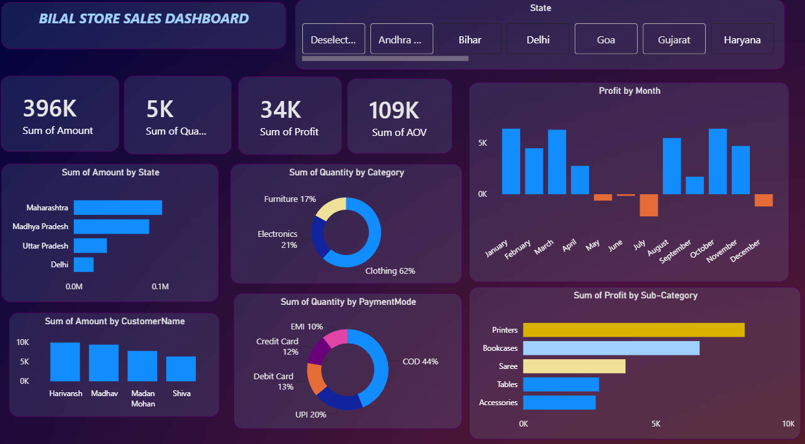
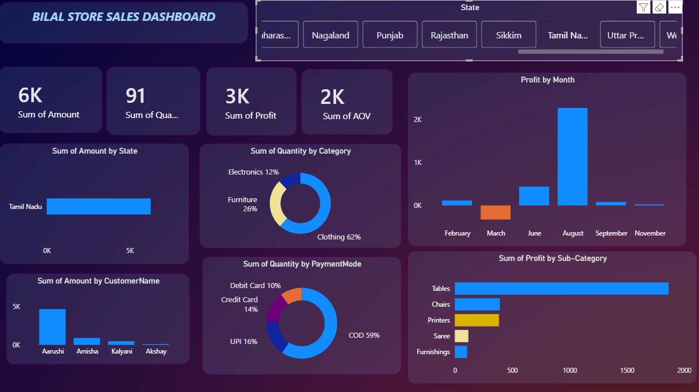
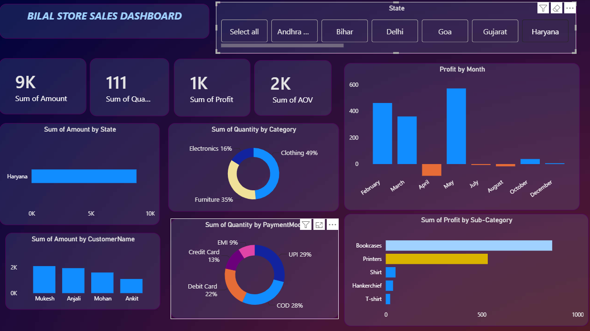
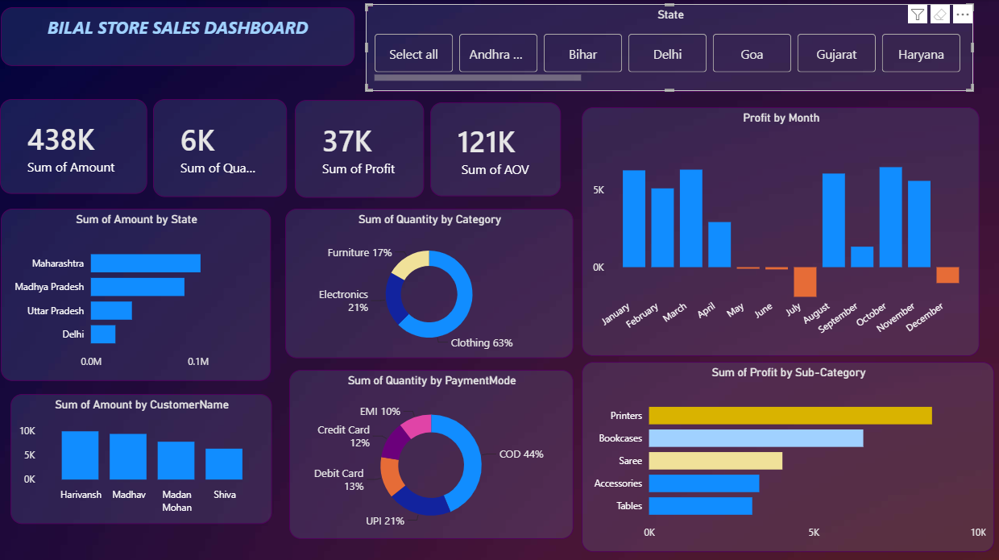

# 📊 Bilal Store Sales Dashboard | Power BI

## 📌 Project Overview

This project is an interactive Power BI dashboard developed to analyze the online sales performance of Bilal Store. It provides business insights through dynamic visualizations, KPI cards, and interactive filters to support better decision-making.

---

## 🎯 Project Objective

The objective of this project is to track and analyze online sales data across different states, product categories, customers, and payment methods using Microsoft Power BI.

---

## 🛠️ Tools & Technologies

- Microsoft Power BI
- Power Query
- DAX (Data Analysis Expressions)
- Data Modeling

---

## ✨ Dashboard Features

- 📈 Total Sales Analysis
- 💰 Profit Analysis
- 📦 Quantity Analysis
- 🛒 Average Order Value (AOV)
- 🌍 Sales by State
- 👥 Sales by Customer
- 🥧 Category-wise Quantity
- 💳 Payment Mode Analysis
- 📅 Monthly Profit Trends
- 🎯 Interactive State Slicer

---

## 📚 Project Learnings

- Designed an interactive business dashboard in Power BI.
- Cleaned and transformed raw data using Power Query.
- Created data relationships using Data Modeling.
- Developed DAX measures and calculated columns.
- Built interactive reports using slicers and filters.
- Created professional visualizations for business insights.

---

## 📸 Dashboard Preview

### Dashboard Overview

### Monthly Sales

### Payment Analysis

### Sales by State

---

## 📁 Repository Files

- Bilal_Store_Sales_Dashboard.pbix
- dashboard-overview.png
- Mothly Sales.png
- Payment analysis.png
- Sales by State.png

---

## 👨‍💻 Author

**Asad Sohail**

Aspiring Data Analyst | Power BI | SQL | Python
